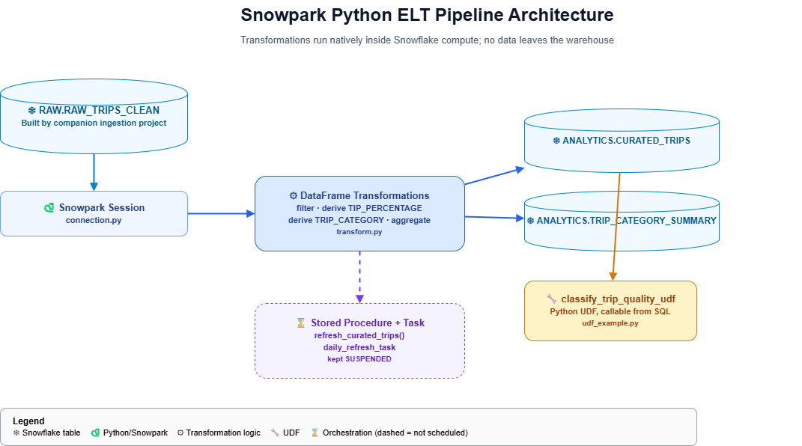

# Snowpark Python ELT Pipeline

A data transformation pipeline built with **Snowpark for Python**, showing
how to move transformation logic from external SQL scripts into Python
DataFrames that execute natively inside Snowflake's compute engine; no
data ever leaves the warehouse during processing.

This is the companion project to
[`nyc-taxi-dimensional-warehouse`](https://github.com/YOUR_USERNAME/nyc-taxi-dimensional-warehouse),
which handles ingestion (S3 → Snowflake, dimensional modeling, SCD Type 2).
This repo picks up where that one leaves off and focuses specifically on
the **transformation layer**, deliberately, since ingestion and
transformation are different concerns in a real pipeline.

## 📐 Architecture

See `docs/architecture_diagram.png`.



RAW.RAW_TRIPS_CLEAN (built by companion ingestion project) │ ▼ Snowpark Session (Python) │ DataFrame transformations (filter, derive TIP_PERCENTAGE, derive TRIP_CATEGORY, aggregate) │ ▼ ANALYTICS.CURATED_TRIPS · ANALYTICS.TRIP_CATEGORY_SUMMARY │ ▼ Registered Python UDF (classify_trip_quality_udf) │ ▼ Optional: Stored Procedure + Task (kept suspended)


## 🗂️ Repository Structure

| Path | Contents |
|---|---|
| `src/connection.py` | Builds the Snowpark Session from environment variables |
| `src/transform.py` | Core DataFrame transformations, writes curated tables |
| `src/udf_example.py` | Registers and tests a Python UDF inside Snowflake |
| `sql/01_stored_procedure_and_task.sql` | Stored procedure + demo Task (kept suspended) |
| `sql/02_monitoring/` | Credit consumption / warehouse state checks |
| `sql/03_teardown/` | Cleanup queries |
| `config/.env.example` | Template for local Snowflake credentials |

## 🚀 How to Reproduce

Requires conda (or any Python 3.10 environment) and the companion
ingestion project run first.

```bash
conda create -n snowflake python=3.10 -y
conda activate snowflake
pip install -r requirements.txt

cp config/.env.example config/.env
# fill in your own Snowflake credentials in config/.env

cd src
python transform.py
python udf_example.py
```

## 🐍 Why Snowpark Instead of Plain SQL

Snowpark lets data engineers write transformation logic in Python; with
proper functions, docstrings, type hints, and the option to unit test it, while execution still happens inside Snowflake's own compute engine.

## 💰 Cost Awareness

Built on a free-trial Snowflake account and an X-Small warehouse
(`AUTO_SUSPEND = 60`). The demo Task is created but deliberately left
**suspended**, since Tasks run independently of warehouse auto-suspend and
are an easy way to accidentally burn credits. See `sql/02_monitoring/` and
`sql/03_teardown/`.

## 📈 What I'd Add for a Production Version

- Unit tests for the UDF and transformation logic (pytest)
- Structured logging instead of print statements
- Actually resuming the Task on a real schedule, with failure alerting
- A dbt-Python model as an alternative implementation, for comparison

## 📬 Contact

**Ali Baghdadi**:  [LinkedIn](https://linkedin.com/in/alibaghdadi)
alibaghdadi1368@gmail.com
